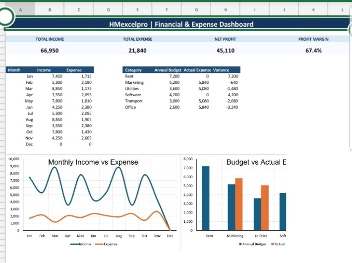

# Excel Financial & Expense Dashboard

A professional Excel financial dashboard designed to monitor income, expenses, cash flow, profitability, and budget performance.

This project demonstrates how Microsoft Excel can be used for financial analysis, expense tracking, budget monitoring, and management reporting.

---

## 📊 Dashboard Preview

---

## 🚀 Project Overview

The dashboard provides a centralized view of financial performance and helps users track income and expenses, monitor net profit, analyze spending patterns, compare budget versus actual results, and review monthly financial performance.

It is designed as a practical portfolio project demonstrating Excel-based financial analysis and reporting.

---

## ✨ Key Features

- Income tracking
- Expense tracking
- Net profit analysis
- Profit margin monitoring
- Cash flow analysis
- Monthly financial reporting
- Expense category analysis
- Budget vs actual comparison
- KPI monitoring
- Financial data visualization
- Management reporting

---

## 📈 Key KPIs

The dashboard provides financial indicators including:

- Total Income
- Total Expenses
- Net Profit
- Profit Margin
- Annual Budget
- Monthly Income
- Monthly Expenses
- Budget Performance

---

## 📁 Workbook Structure

The Excel workbook includes sections for:

- Financial transactions
- Income and expense records
- Budget planning
- Financial analysis
- KPI reporting
- Management dashboard
- Data entry
- Instructions

---

## 🛠️ Skills Demonstrated

- Microsoft Excel
- Financial Analysis
- Data Analysis
- Data Processing
- Data Visualization
- Dashboard Design
- Budget Analysis
- KPI Reporting
- Management Reporting

---

## 💡 How to Use

1. Download the Excel workbook.
2. Open it in Microsoft Excel.
3. Review the financial transaction data.
4. Review or update the budget information.
5. Navigate to the financial dashboard.
6. Analyze income, expenses, profitability, and budget performance.

> This portfolio project uses demonstration data and is intended to showcase Excel financial dashboard and data analysis skills.

---

## 💼 Freelance Services

I create customized Excel solutions for business and financial reporting needs, including:

- Financial dashboards
- Income and expense trackers
- Budget reports
- Excel dashboards
- Data cleaning and processing
- KPI reporting
- Data visualization
- Management reports

---

## 👤 Author

**HMexcelpro**

Excel • Data Analysis • Data Visualization • Dashboard Design • Financial Reporting
